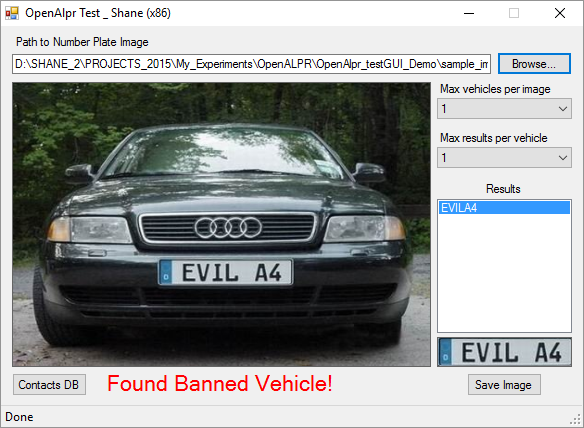

# openalpr_manual_demo
Vehicle Number Plate recognition in VB.NET using OpenALPR bindings

A VB.NET demo of an open source Automatic License Plate Recognition library called [OpenALPR](https://github.com/openalpr/openalpr)  
This project tests out some of OpenALPR's capabilities, by allowing the user to browse and select an image file for analysis.

OpenALPR has bindings in C#, Python, Node.js, Go, and Java. They provide usage examples at http://doc.openalpr.com/bindings.html
